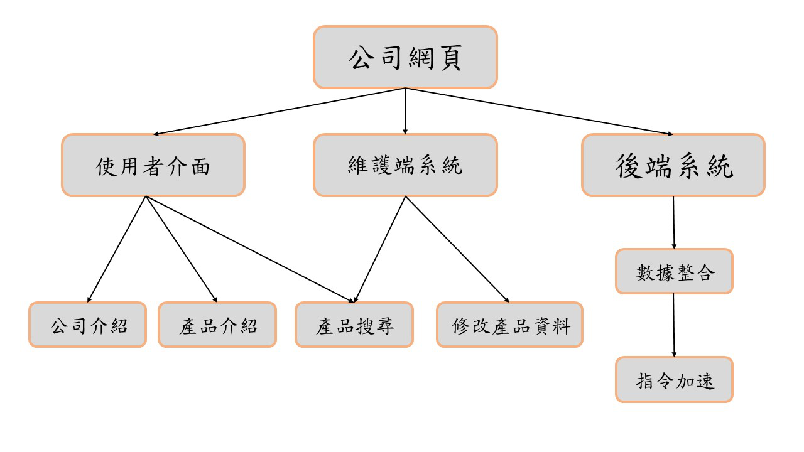
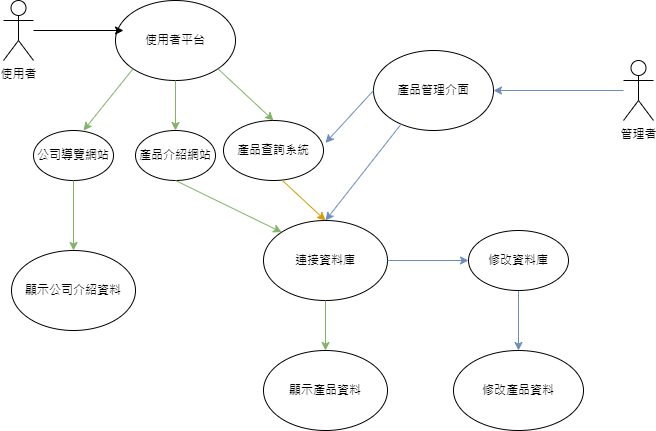

# 功能性需求
1:提供各功能分類，以及產品的細分

2:製作維護系統，更方便修改資料庫的資料

3:新增查詢系統，讓使用者能快速或搜索需要的商品

---
# 非功能性需求
1:性能:使用AVL tree芳姿存取資料庫的資料，降低搜索及新增產品資料所需的時間

2:在維護系統建設利帳號密碼，避免遭到惡意修改

3:減少複雜功能，讓維護端能快速修改資料

---
# FDD圖

---
# 需求分析
1:使用者查看公司介紹及產品

2:管理者維護產品資料

3:兩方都能搜尋自己所需的產品

---
# 使用者案例圖

---
# 案例說明

---
# Figma

