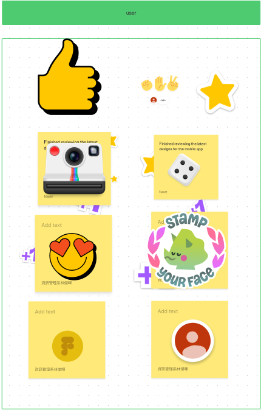

# 功能性需求
1:提供各功能分類，以及產品的細分

2:製作維護系統，更方便修改資料庫的資料

3:新增查詢系統，讓使用者能快速或搜索需要的商品

---
# 非功能性需求
1:性能:使用AVL tree芳姿存取資料庫的資料，降低搜索及新增產品資料所需的時間

2:在維護系統建設利帳號密碼，避免遭到惡意修改

3:減少複雜功能，讓維護端能快速修改資料

---
# FDD圖

---
# 需求分析
1:使用者查看公司介紹及產品

2:管理者維護產品資料

3:兩方都能搜尋自己所需的產品

---
# 使用者案例圖

---
# 案例說明
|使用者案例名稱|丹露實業有限公司網站|
|:----:|:---|
|人員|使用者、管理者|
|說明|使用者使用網頁功能以及管理者維護產品資料|
|完成動作|1.使用者查看公司資料 2.使用者查看產品資料 3.使用者或管理者查詢產品 4.管理者修改產品資料|
|替代方法|1.使用者查看公司資料 2.使用者查看產品資料<br3.系統端查找資料 4.系統端修改資料庫|
|先決條件|管理者登入維護系統|
|後至條件|系統運作正常|
---
# Figma

